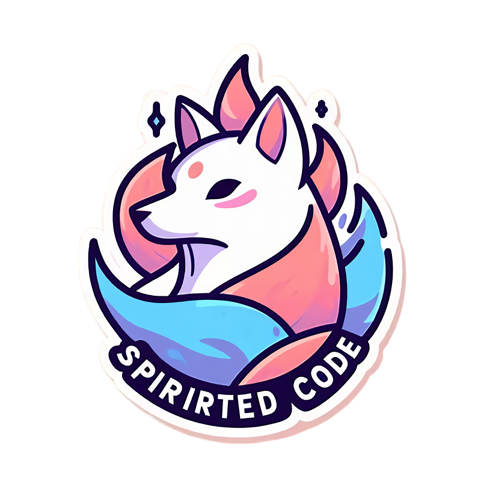

<p align="center">
  
</p>

# Spirited Code
Advent of code collection from different years in different languages. Who got the fastest solution?

### Project structure

The project structure will be designed as the following:

```python
spirited_code
├── src/ # The source code for AoC
│   ├── year/ # The year from when the excercises are
│   │   ├── day/ # The day of the excercise: "day-01"
│   │   │   ├── lang/ # The language in which your solution is written
│   │   │   │   ├── user/ # Your username (github username for easy identification)
├── bench/ # Benchmark scripts
```

### Naming convention

Branches should follow this format: `year/day/lang/user`.

Once they are finished they can get merged into master.

## Benchmarking

Inside the bench folder there will be a benchmark script in the future to test all available scripts on different machines.

How exactly the benching will be done is not yet defined. To ensure a working bench it is required to stay inside the required project structure.
